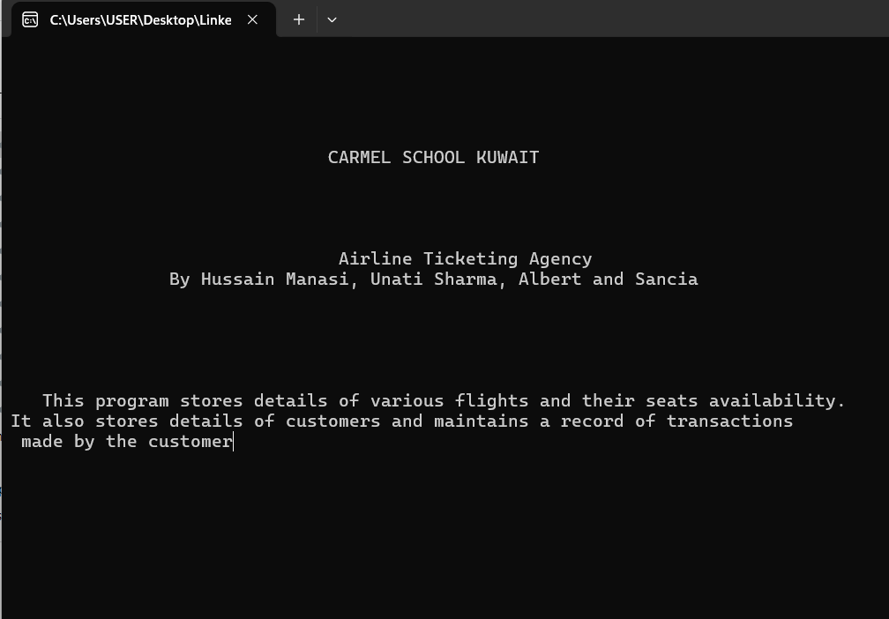
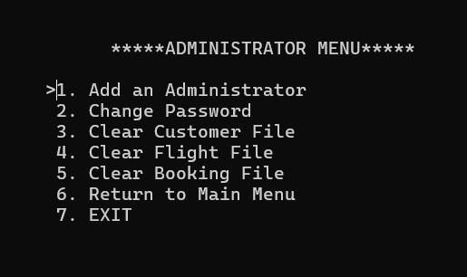
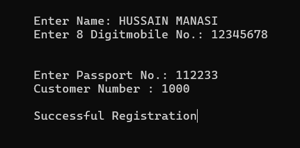
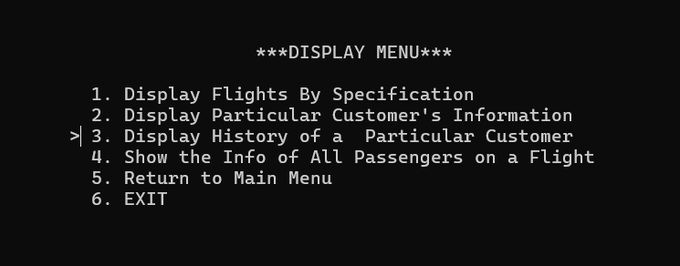
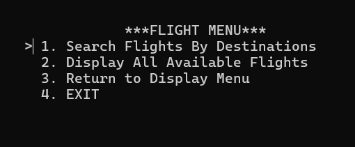
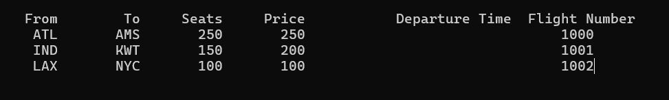
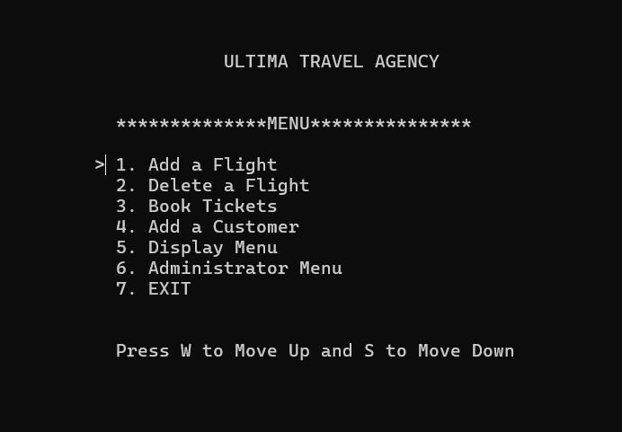

# Airline-System
C++ code that allows managing of flights from an admin terminal. Allows adding and deleting flights, booking, and cancellation with history of customers as well as reward points system

Basic file handling, polymorphism, classes and objects managed in this fully functional project.
The only caveat is that it fire up from the terminal, so if possible gotta work on building a GUI for all of it, otherwise the display is made using gotoxy() several times to make it look as visually pleasing as possible.

Additionally, the code is built on Turbo C++, as a mingw compilation. Which is why it might have issues launching on a traditional C++ linux system.

Initial development was done on Borlands C++ back in 2017. I recreated it in 2024 using msys2 to install mingw. You can follow the guide on wikihow to install the software: https://www.wikihow.com/Compile-CPP-File-to-EXE

# Project Screenshots

Welcome to the project! Below are some key screenshots that demonstrate the user interface and various functionalities of the application.

## Images

### 1. **Welcome Screen**

This is the initial welcome screen of the application that users see when they launch it.

### 2. **Admin Menu**

The Admin Menu provides the administrator with options to manage flights, users, and settings. It is the central hub for administrators.

### 3. **Customer Add**

This screen allows the admin to add new customer details, such as personal information and preferences.

### 4. **Display Menu**

The Display Menu presents the available options for users to view and manage flight information.

### 5. **Flight Menu**

The Flight Menu allows users to explore flight options, search for available flights, and book tickets.

### 6. **Flights Overview**

This screen shows an overview of available flights, including flight numbers, destinations, and seat availability.

### 7. **Homepage**

The homepage displays the main dashboard and provides quick access to the core functionalities of the application.

---

Feel free to explore the various features of the application as demonstrated through the images above. If you have any questions or suggestions, feel free to contact me.
